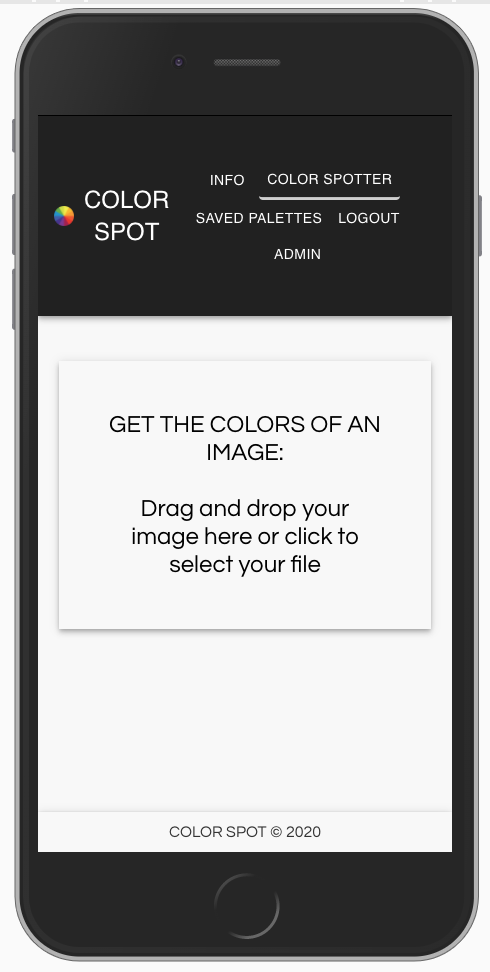

# COLOR SPOT - React app with color API and data visualization

In this React app, users can detect the colors in images as well as save and categorize color palettes.  
An "admin" page visualizes the data from the users using the app (made with chart.js).  

API used: color-thief by Lokesh Dhakar

[visit live app](https://color-spot.herokuapp.com)

## Features

-   drag and drop an image to detect its colors using color-thief API
     
-   save color palettes and categorize them with tags (only for logged in users)
     
-   filter saved color palettes by tag (only for logged in users)
     
-   admin page where users can visualize data about the the app's users (made with chart.js)
     
-   login/ register (password hashed with bcrypt)
     
-   create & update profile
     
-   delete account & all associated info
     
-   logout

## Tech

**Stack**: HTML, CSS, JavaScript, Node.js, PostgreSQL  
**Front-end Framework**: React  
**Protection**: CSURF  
**Testing**: React Testing Library + Jest | **Deployment**: Heroku

## Future improvements

-   Add auth with Google Sign-In
-   Automate sending of emails to enable users to reset their password
-   Add more features to the "SAVED PALETTES" section

## Visuals

