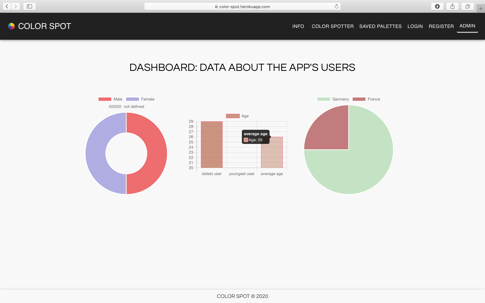

# React app with color API and data visualization

React app where users can detect the colors of images as well as save and categorize color palettes.  
An "admin" page (made with chart.js) visualizes data from the app's users.  

API used: color-thief by Lokesh Dhakar

[visit live app](https://color-spot.herokuapp.com)

## Features

-   drag and drop/upload image to detect its colors using color-thief API
     
-   login/ register (password hashed with bcrypt) or with Google Sign In
     
-   create & update profile
     
-   save color palettes and categorize them with tags (only for logged in users)
     
-   filter saved color palettes by tag (only for logged in users)
     
-   admin page that visualizes data about the the app's users (made with chart.js)(protected by password)
     
-   delete account
     
-   logout

## Tech

**Stack**: SASS/SCSS, JavaScript, React, Node.js, PostgreSQL, chart.js, material-ui, Google Sign In 
**Protection**: CSURF  
**Testing**: React Testing Library + Jest | **Deployment**: Heroku

## Future improvements

-   Add color picker (Swatches)
-   Automate sending of emails to enable users to reset their password
-   Develop mobile app with React Native

## Visuals

